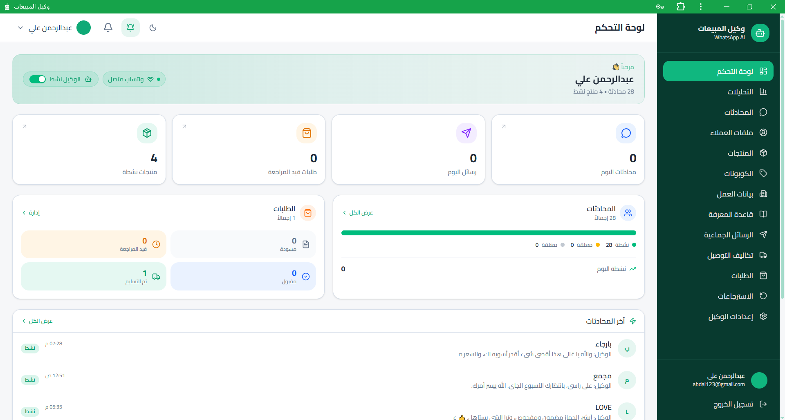
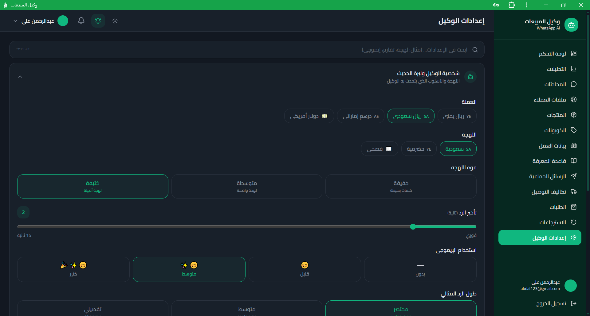
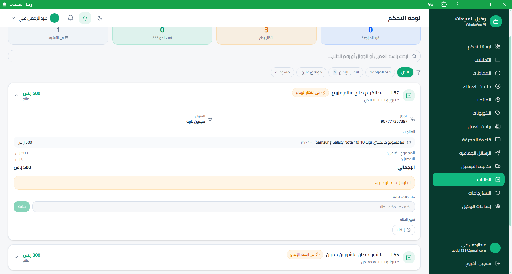
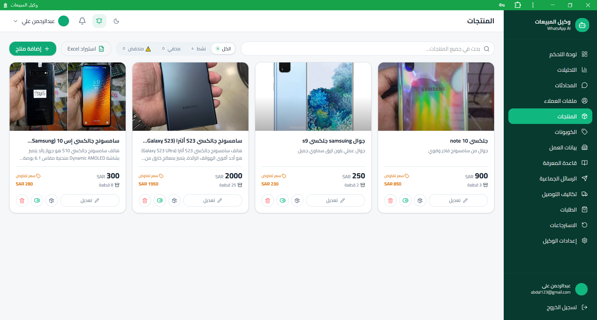
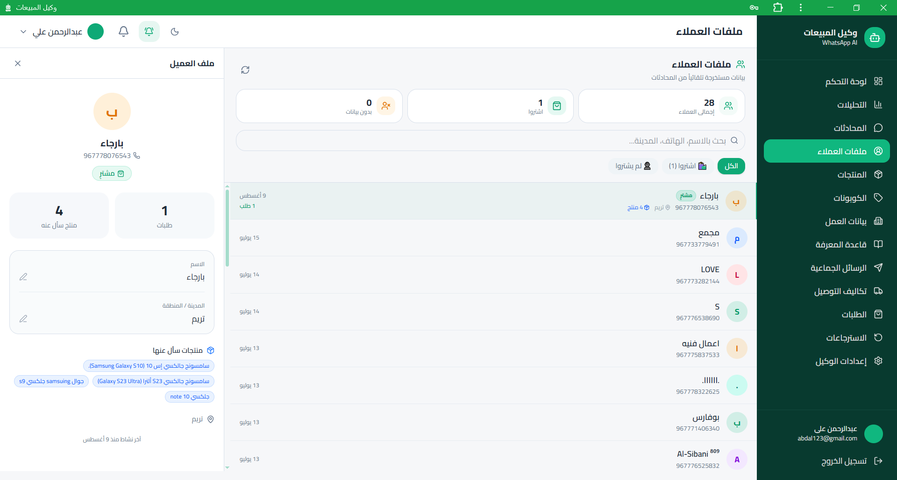

 

# 🚀 WhatsApp AI Sales Agent

<p align="center">
  
</p>

<h2 align="center">منصة متكاملة لأتمتة المبيعات وخدمة العملاء باستخدام الذكاء الاصطناعي</h2>

<p align="center">
  AI Agents • RAG • WhatsApp Automation • Customer Intelligence • Order Automation • Business Workflows
</p>

---

## 📌 نبذة عن المشروع

** WA Sales Agent **هو نظام تجاري حقيقي يعمل حاليًا، تم تطويره بهدف أتمتة عمليات المبيعات وخدمة العملاء باستخدام الذكاء الاصطناعي، وربطها مباشرة ببيانات المتجر وعملياته اليومية.

المشروع لا يعتمد على مفهوم روبوت المحادثة التقليدي الذي يستقبل السؤال ويرسل إجابة فقط، وإنما تم تصميمه كنظام **وكيل ذكاء اصطناعي قادر على تنفيذ العمليات**.

يستطيع العميل التواصل مع المتجر من خلال WhatsApp، ثم يتولى النظام فهم الرسالة، واسترجاع المعلومات المناسبة، والبحث عن المنتجات، والاستفادة من سياق المحادثة والعميل، واستخدام الأدوات المتاحة لتنفيذ عمليات حقيقية مثل إنشاء الطلبات، التعامل مع الدفع، إنشاء الفواتير، وإدارة طلبات الاسترجاع.

بمعنى آخر، المشروع يحاول نقل الذكاء الاصطناعي من مرحلة:

> "نظام يجيب عن الأسئلة"

إلى مرحلة:

> "نظام يفهم الطلب وينفذ العمل."

---

## 🎯 المشكلة التي يحلها المشروع

تعتمد الكثير من المتاجر على WhatsApp كقناة أساسية للبيع والتواصل مع العملاء، ولكن مع ازدياد عدد العملاء تصبح العمليات اليدوية عبئًا كبيرًا.

من أمثلة هذه العمليات:

- الرد المتكرر على أسئلة العملاء.
- البحث عن المنتجات والأسعار.
- شرح العروض والكوبونات.
- جمع بيانات العميل.
- تسجيل الطلبات.
- حساب قيمة الطلب.
- متابعة الدفع.
- مراجعة سندات الإيداع.
- إنشاء الفواتير.
- متابعة العملاء.
- التعامل مع طلبات الاسترجاع.
- تحديث بيانات العملاء.
- الرجوع إلى معلومات المتجر أثناء المحادثة.

تم بناء WA Sales Agent لربط هذه العمليات داخل منظومة واحدة وتقليل التدخل اليدوي قدر الإمكان.

---

# 💡 الفكرة

في النظام التقليدي تكون دورة العمل تقريبًا:

```text
العميل
   ↓
WhatsApp
   ↓
الموظف
   ↓
البحث عن المعلومات
   ↓
الرد على العميل
   ↓
تسجيل الطلب يدويًا
   ↓
مراجعة الدفع
   ↓
إنشاء الفاتورة
   ↓
متابعة الطلب
```

أما في WA Sales Agent:

```text
العميل
   ↓
WhatsApp
   ↓
Evolution API
   ↓
Webhook
   ↓
AI Agent
   ↓
فهم الرسالة
   ↓
تحميل سياق المحادثة والعميل
   ↓
البحث في قاعدة المعرفة
   ↓
البحث عن المنتجات
   ↓
استخدام أدوات النظام عند الحاجة
   ↓
تنفيذ العملية التجارية
   ↓
تحديث قاعدة البيانات
   ↓
إرسال النتيجة
   ↓
WhatsApp
   ↓
العميل
```

---

# 🏗️ المعمارية العامة

```text
                         ┌─────────────────────┐
                         │       العميل        │
                         └──────────┬──────────┘
                                    │
                                    ▼
                         ┌─────────────────────┐
                         │      WhatsApp       │
                         └──────────┬──────────┘
                                    │
                                    ▼
                         ┌─────────────────────┐
                         │   Evolution API     │
                         └──────────┬──────────┘
                                    │
                                    ▼
                         ┌─────────────────────┐
                         │       Webhook       │
                         └──────────┬──────────┘
                                    │
                                    ▼
                  ┌──────────────────────────────────┐
                  │            AI Agent               │
                  │                                  │
                  │  Context / Memory / Reasoning    │
                  │  Prompt / Tools / Business Rules│
                  └───────────────┬──────────────────┘
                                  │
             ┌────────────────────┼────────────────────┐
             │                    │                    │
             ▼                    ▼                    ▼
      ┌──────────────┐     ┌──────────────┐     ┌──────────────┐
      │     RAG      │     │  AI Tools    │     │   Customer   │
      │ Knowledge    │     │              │     │   Context    │
      └──────┬───────┘     └──────┬───────┘     └──────┬───────┘
             │                    │                    │
             └────────────────────┼────────────────────┘
                                  │
                                  ▼
                       ┌─────────────────────┐
                       │   Business Logic    │
                       └──────────┬──────────┘
                                  │
                 ┌────────────────┼────────────────┐
                 │                │                │
                 ▼                ▼                ▼
             Products           Orders          Returns
                 │                │                │
                 └────────────────┼────────────────┘
                                  │
                                  ▼
                       ┌─────────────────────┐
                       │       Database      │
                       └──────────┬──────────┘
                                  │
                                  ▼
                       ┌─────────────────────┐
                       │ Invoice / Actions   │
                       └──────────┬──────────┘
                                  │
                                  ▼
                              WhatsApp
```

---

# 🤖 وكيل المبيعات الذكي

المكون الرئيسي في النظام هو وكيل المبيعات الذكي.

الوكيل لا يعمل كنموذج نصي منفصل عن التطبيق، بل هو جزء من المنظومة التشغيلية.

عند وصول رسالة جديدة، يمر النظام بعدة مراحل:

```text
رسالة العميل
     ↓
تحديد العميل والإعدادات
     ↓
تحميل المحادثة السابقة
     ↓
تحميل بيانات الطلب النشط
     ↓
تحليل نية العميل
     ↓
البحث في قاعدة المعرفة
     ↓
بناء سياق المتجر
     ↓
بناء تعليمات الوكيل
     ↓
استدعاء النموذج
     ↓
اختيار الأدوات عند الحاجة
     ↓
تنفيذ العملية
     ↓
بناء الرد النهائي
     ↓
إرساله إلى العميل
```

ومن أمثلة المهام التي يستطيع الوكيل تنفيذها:

- الإجابة عن الأسئلة.
- البحث عن المنتجات.
- معرفة الأسعار.
- عرض معلومات المتجر.
- اقتراح المنتجات.
- البيع الإضافي.
- متابعة السلة.
- جمع معلومات الطلب.
- إنشاء الطلب.
- التعامل مع الدفع.
- طلب الاسترجاع.
- تحديث بيانات العميل.
- إرسال صور المنتجات.
- إرسال الفواتير والمستندات.

---

# 💬 أتمتة WhatsApp

تم ربط النظام بـ WhatsApp من خلال طبقة تكامل تعتمد على Evolution API.

مسار الرسالة:

```text
WhatsApp
   ↓
Evolution API
   ↓
Webhook
   ↓
Message Processing
   ↓
AI Agent
   ↓
Business Logic
   ↓
Evolution API
   ↓
WhatsApp
```

ولا يقتصر الأمر على إرسال واستقبال النصوص، بل توجد طبقات للتعامل مع أنواع مختلفة من الأحداث والرسائل، وإدارة حالات مثل الكتابة والتجميع والتكرار وإرسال الوسائط عند الحاجة.

---

# 🧠 نظام RAG

من أهم المكونات التقنية في المشروع نظام:

```text
Retrieval-Augmented Generation
```

الهدف من هذا النظام هو إعطاء الوكيل معلومات مرتبطة بالمتجر قبل أن يقوم بتوليد الإجابة.

بدل الاعتماد على المعرفة العامة للنموذج، يتم استرجاع المعلومات ذات العلاقة من قاعدة المعرفة.

مثال:

```text
سؤال العميل
    ↓
تحويل السؤال إلى تمثيل دلالي
    ↓
البحث عن المعلومات الأقرب
    ↓
اختيار النتائج ذات الصلة
    ↓
إضافتها إلى السياق
    ↓
إرسالها إلى النموذج
    ↓
إنشاء الإجابة
```

---

# 📚 قاعدة المعرفة

يمكن أن تحتوي قاعدة المعرفة على أنواع متعددة من البيانات، مثل:

- المنتجات.
- أوصاف المنتجات.
- الأسعار.
- المخزون.
- الكوبونات.
- العروض.
- بيانات المتجر.
- الفروع.
- أوقات العمل.
- الحسابات البنكية.
- طرق التواصل.
- سياسات الاسترجاع.
- سياسة التوصيل.
- المعلومات الإضافية التي يحتاجها الوكيل.

وهذا يجعل النظام قادرًا على الإجابة بناءً على معلومات المتجر الفعلية.

---

# 🔎 البحث الدلالي

يستخدم المشروع Embeddings للبحث الدلالي.

وهذا يعني أن النظام لا يبحث فقط عن التطابق الحرفي بين الكلمات، وإنما يحاول الوصول إلى المعلومات التي تحمل المعنى نفسه.

على سبيل المثال:

```text
هل عندكم جوال سامسونج؟
```

و:

```text
أريد هاتف Samsung
```

و:

```text
ما أجهزة سامسونج الموجودة؟
```

يمكن أن تؤدي إلى نتائج متقاربة لأن النظام يبحث في المعنى وليس فقط في النص الحرفي.

---

# 🛍️ ذكاء المنتجات

بيانات المنتجات ليست منفصلة عن نظام الذكاء الاصطناعي.

يستطيع الوكيل استخدام معلومات المنتجات أثناء المحادثة من أجل:

- البحث.
- معرفة الأسعار.
- معرفة التوفر.
- الإجابة عن الأسئلة.
- المقارنة.
- التوصية.
- البيع الإضافي.
- بناء السلة.

وهذا يجعل طبقة المنتجات جزءًا من عملية التفكير الخاصة بالوكيل.

---

# 🛒 أتمتة إنشاء الطلبات

يمكن تحويل المحادثة مباشرة إلى طلب حقيقي.

بدل أن يقوم الموظف بجمع المعلومات يدويًا، يستطيع الوكيل جمع البيانات المطلوبة أثناء المحادثة.

مثل:

```text
اسم العميل
رقم الهاتف
العنوان
المنتجات
الكميات
السعر
التوصيل
الإجمالي
رقم مرجع الدفع
```

ثم يتم تحويل هذه المعلومات إلى عملية منظمة داخل النظام.

```text
المحادثة
   ↓
جمع البيانات
   ↓
التحقق من المعلومات
   ↓
إنشاء الطلب
   ↓
حالة الدفع
   ↓
المراجعة
   ↓
معالجة الطلب
```

---

# 🧾 دورة الطلب

الطلب يمر بعدة حالات بحسب المرحلة التي وصل إليها.

تصور مبسط:

```text
طلب جديد
   ↓
انتظار الدفع
   ↓
استلام إثبات الدفع
   ↓
انتظار المراجعة
   ↓
تأكيد الطلب
   ↓
معالجة الطلب
   ↓
إتمام العملية
```

ولا يتم التعامل مع الطلب كنص داخل المحادثة فقط، بل توجد بيانات منظمة مرتبطة به.

---

# 💳 نظام الدفع

يرتبط نظام الدفع مباشرة بدورة الطلب.

يمكن استقبال بيانات الدفع أو سند الإيداع ثم ربطه بالطلب ومراجعته حسب حالة النظام.

```text
الطلب
   ↓
انتظار الدفع
   ↓
إرسال إثبات الدفع
   ↓
التحقق
   ↓
مراجعة الإدارة عند الحاجة
   ↓
تحديث حالة الطلب
```

كما يحتوي النظام على منطق خاص للتعامل مع عمليات التحقق والقبول والمراجعة.

---

# 📄 إنشاء الفواتير

بعد إتمام العمليات المطلوبة، يستطيع النظام إنشاء فاتورة بصيغة PDF.

```text
بيانات الطلب
    ↓
بيانات العميل
    ↓
حساب الإجمالي
    ↓
إنشاء الفاتورة
    ↓
PDF
    ↓
إرسالها للعميل عبر WhatsApp
```

وهذا يربط عملية البيع بالمستندات النهائية دون الحاجة إلى إنشاء الفاتورة يدويًا.

---

# 🔄 نظام الاسترجاع

تم بناء نظام خاص للتعامل مع طلبات الاسترجاع.

يمكن للعميل بدء العملية من خلال WhatsApp.

```text
العميل
   ↓
طلب استرجاع
   ↓
جمع المعلومات
   ↓
تحديد الطلب
   ↓
تسجيل طلب الاسترجاع
   ↓
مراجعة الإدارة
   ↓
قبول / رفض
```

وفي حالة قبول الاسترجاع، يمكن للنظام تنفيذ الإجراءات المرتبطة بالطلب والمخزون.

---

# 👤 Customer Intelligence

يحاول النظام بناء صورة أفضل عن العميل بدل اعتباره مجرد رقم هاتف.

يتم استخراج وربط البيانات من التفاعلات والطلبات.

يمكن أن تشمل:

- الاسم.
- المدينة.
- المهنة.
- الاهتمامات.
- المنتجات المفضلة.
- تصنيفات العميل.
- المعلومات التي تظهر أثناء المحادثة.

وهذا يسمح بإنشاء تجربة أكثر تخصيصًا للمستخدم.

---

# 🎯 استراتيجيات المبيعات

تم تصميم سلوك الوكيل ليكون مناسبًا للمبيعات، وليس فقط للدعم.

## Upselling

اقتراح منتج أو خدمة مكملة للطلب الحالي.

## Follow-up

متابعة العميل في الحالات المناسبة.

## Cart

مساعدة العميل في إكمال السلة والطلب.

## Promotions

التعامل مع العروض والكوبونات عندما يكون ذلك مناسبًا.

## Recommendations

اقتراح منتجات اعتمادًا على سياق العميل واحتياجاته.

---

# 🧰 أدوات الوكيل

يستخدم المشروع مفهوم Tool Calling حتى يستطيع الوكيل الانتقال من التفكير إلى التنفيذ.

```text
العميل
   ↓
AI Agent
   ↓
Reasoning
   ↓
اختيار الأداة
   ↓
تنفيذ الوظيفة
   ↓
قاعدة البيانات / خدمة خارجية
   ↓
الحصول على النتيجة
   ↓
إعادة النتيجة للوكيل
   ↓
الرد على العميل
```

وهذا يسمح بتنفيذ عمليات مثل:

```text
إنشاء طلب
تحديث طلب
طلب استرجاع
البحث في البيانات
الحصول على معلومات المنتج
التعامل مع بيانات العميل
```

بحسب الأدوات المفعلة في النظام.

---

# 🧠 شخصية الوكيل

يدعم النظام إعداد شخصية الوكيل وسلوكه بما يتناسب مع النشاط التجاري.

يمكن التحكم في عناصر مثل:

- اللهجة.
- أسلوب الكتابة.
- النبرة.
- درجة الرسمية.
- درجة الإقناع.
- طول الرد.
- مستوى استخدام الرموز التعبيرية.
- بعض استراتيجيات المبيعات.

وهذا يسمح باستخدام نفس البنية مع متاجر مختلفة وشخصيات مختلفة للوكيل.

---

# 🖼️ إرسال صور المنتجات

يمكن للنظام التعامل مع صور المنتجات ضمن المحادثة.

عندما يطلب العميل صورة منتج أو يتم التعرف على منتج مناسب، يستطيع النظام إرسال الصورة عبر قناة WhatsApp.

وهذا يجعل تجربة البيع أقرب إلى التفاعل الطبيعي مع موظف مبيعات.

---

# 🖥️ لوحة التحكم

تم بناء لوحة تحكم لإدارة النظام ومتابعة البيانات والعمليات.

تشكل لوحة التحكم الطبقة الإدارية للمنصة، وتجمع مجموعة من الوظائف في مكان واحد.

من خلالها يمكن إدارة ومتابعة:

- المنتجات.
- الطلبات.
- العملاء.
- الإعدادات.
- بيانات المتجر.
- إعدادات الوكيل الذكي.
- عمليات الاسترجاع.
- البيانات التشغيلية.

### صورة لوحة التحكم


---

# 🤖 صفحة إعداد الوكيل



---

# 🛒 صفحة الطلبات



---

# 🛍️ صفحة المنتجات



---

# 👤 صفحة العميل



---


---

# 🗂️ تنظيم المشروع

يتكون المشروع من عدة طبقات رئيسية.

```text
WA_Agent/
│
├── artifacts/
│   └── api-server/
│       ├── src/
│       │   ├── routes/
│       │   ├── lib/
│       │   └── ...
│       └── ...
│
├── lib/
│   └── db/
│
├── scripts/
│
├── docs/
│
├── public/
│
├── package.json
│
└── pnpm-workspace.yaml
```

---

# ⚙️ المكونات الرئيسية

## محرك استقبال الرسائل

المسؤول عن استقبال Webhooks القادمة من WhatsApp ومعالجة الحدث الأولي.

## محرك الوكيل

المسؤول عن بناء السياق وتشغيل النموذج ومعالجة ردوده.

## طبقة المعرفة

المسؤولة عن البحث في المعلومات الخاصة بالمتجر.

## طبقة الطلبات

المسؤولة عن إنشاء الطلبات وتعديلها ومتابعتها.

## طبقة الاسترجاع

المسؤولة عن طلبات الإرجاع والمراجعة.

## طبقة العملاء

المسؤولة عن بيانات العميل وتحديث ملفه.

## طبقة الفواتير

المسؤولة عن إنشاء ملفات PDF وإرسالها.

## طبقة WhatsApp

المسؤولة عن التواصل عبر Evolution API.

---

# 🧠 دورة معالجة الرسالة بالكامل

عند وصول رسالة، تمر العملية بشكل تقريبي بالمراحل التالية:

```text
1. استقبال الحدث
        ↓
2. تحديد المستخدم
        ↓
3. فحص التكرار
        ↓
4. تجميع الرسائل المتتالية عند الحاجة
        ↓
5. التحقق من حالة الوكيل
        ↓
6. تحميل المحادثة
        ↓
7. تحميل الطلب النشط
        ↓
8. بناء سياق المتجر
        ↓
9. البحث الدلالي
        ↓
10. بناء System Prompt
        ↓
11. استدعاء نموذج الذكاء الاصطناعي
        ↓
12. معالجة Tool Calls
        ↓
13. تنفيذ Business Logic
        ↓
14. تحديث قاعدة البيانات
        ↓
15. إنشاء الرد النهائي
        ↓
16. إرسال الرد عبر WhatsApp
        ↓
17. تنفيذ العمليات اللاحقة
```

---

# 🧩 التقنيات المستخدمة

## الواجهة

```text
TypeScript
React
Modern UI Architecture
Component Architecture
State Management
```

## الخادم

```text
Node.js
TypeScript
API Routes
Webhooks
Business Logic
```

## الذكاء الاصطناعي

```text
AI Agents
LLM APIs
Tool Calling
Prompt Engineering
Groq
Google Gemini
Cohere
```

## البحث والاسترجاع

```text
RAG
Embeddings
Vector Search
Semantic Search
Knowledge Base
Context Retrieval
```

## قاعدة البيانات

```text
PostgreSQL
Supabase
```

## التكامل مع WhatsApp

```text
WhatsApp
Evolution API
Webhooks
```

## المستندات

```text
PDF Generation
Invoice Generation
File Processing
```

---

# 🗄️ البيانات الرئيسية

يتعامل النظام مع مجموعة من البيانات المترابطة.

```text
Users
   │
   ├── Customers
   │      │
   │      ├── Conversations
   │      ├── Orders
   │      └── Profile
   │
   ├── Products
   │
   ├── Knowledge
   │
   └── Business Settings

Orders
   │
   ├── Payment
   ├── Invoice
   └── Returns
```

هذا الربط يسمح للوكيل بالوصول إلى السياق المناسب بدل التعامل مع كل رسالة بشكل منفصل.

---

# ⚙️ التشغيل المحلي

## المتطلبات

```text
Node.js
pnpm
PostgreSQL / Supabase
Evolution API
AI Provider APIs
```

## تثبيت المشروع

```bash
git clone https://github.com/hsn347/WA_Agent.git
cd WA_Agent
pnpm install
```

## إعداد البيئة

أنشئ ملف البيئة المطلوب وأضف القيم المناسبة للبيئة المحلية.

مثال تقريبي:

```env
DATABASE_URL=

SUPABASE_URL=
SUPABASE_ANON_KEY=

GROQ_API_KEY=
GEMINI_API_KEY=
COHERE_API_KEY=

EVOLUTION_API_URL=
EVOLUTION_API_KEY=
```

## تشغيل المشروع

```bash
pnpm dev
```

---

# 📈 قابلية التوسع

تم بناء المنظومة مع فصل طبقة الذكاء الاصطناعي عن منطق الأعمال وطبقة البيانات وتكامل WhatsApp.

وهذا يفتح المجال مستقبلًا لإضافة قنوات أخرى.

```text
                    AI Core
                       │
          ┌────────────┼────────────┐
          │            │            │
          ▼            ▼            ▼
      WhatsApp     Website Chat   Instagram
          │            │            │
          └────────────┼────────────┘
                       │
                       ▼
                 Business Logic
                       │
            ┌──────────┼──────────┐
            ▼          ▼          ▼
        Products     Orders    Customers
```

---

# 🌍 حالات الاستخدام

يمكن استخدام نفس الفكرة في:

### المتاجر الإلكترونية

أتمتة خدمة العملاء والمبيعات.

### المتاجر المحلية

تحويل WhatsApp إلى قناة بيع ذكية.

### Social Commerce

إدارة العملاء القادمين من الشبكات الاجتماعية.

### Customer Support

الإجابة على الأسئلة بناءً على قاعدة معرفة الشركة.

### Order Automation

تحويل المحادثة إلى طلب فعلي.

### AI Business Agents

بناء وكلاء قادرين على التفكير واستخدام الأدوات وتنفيذ العمليات.

---

# 🧪 حالة المشروع

```text
Production / Active
```

WA Sales Agent ليس مشروعًا تعليميًا أو مجرد Proof of Concept.

تم تطويره ليعمل في سيناريو حقيقي، ويتم تطوير النظام وإضافة التحسينات والعمليات الجديدة بصورة مستمرة.

# 🚀 التطوير المستقبلي

يمكن توسيع المشروع في اتجاهات متعددة:

- إضافة قنوات تواصل جديدة.
- تطوير تحليلات المبيعات.
- إنشاء تقارير تلقائية.
- تحسين Customer Intelligence.
- تطوير أنظمة توصية أكثر تقدمًا.
- إضافة أدوات جديدة للوكيل.
- توسيع الأتمتة التسويقية.
- إنشاء وكلاء متخصصين.
- تحسين أنظمة المتابعة.
- ربط المزيد من الخدمات الخارجية.

---

# ⭐ الخلاصة

WA Sales Agent هو مشروع يجمع بين:

```text
Artificial Intelligence
+
AI Agents
+
RAG
+
Vector Search
+
WhatsApp
+
Automation
+
Commerce
+
Orders
+
Payments
+
Returns
+
Customer Intelligence
+
Business Logic
+
Database
```

في منصة واحدة.

الهدف النهائي ليس جعل العميل يتحدث مع نموذج ذكاء اصطناعي فقط.

الهدف هو أن يتمكن العميل من بدء العملية داخل WhatsApp، ثم يتولى النظام فهم الطلب، البحث، اتخاذ القرار، تنفيذ العملية، تحديث البيانات، وإعادة النتيجة للعميل.

```text
العميل
   ↓
المحادثة
   ↓
الفهم
   ↓
البحث
   ↓
التحليل
   ↓
الأداة
   ↓
التنفيذ
   ↓
التحقق
   ↓
النتيجة
```

> **WA Sales Agent يحول الذكاء الاصطناعي من مجرد مساعد للمحادثة إلى عامل رقمي قادر على تنفيذ العمليات التجارية.**

---

<p align="center">

WA Sales Agent

### AI-Powered Commerce Automation

**AI • RAG • WhatsApp • Automation • Real Business Workflows**

</p>
